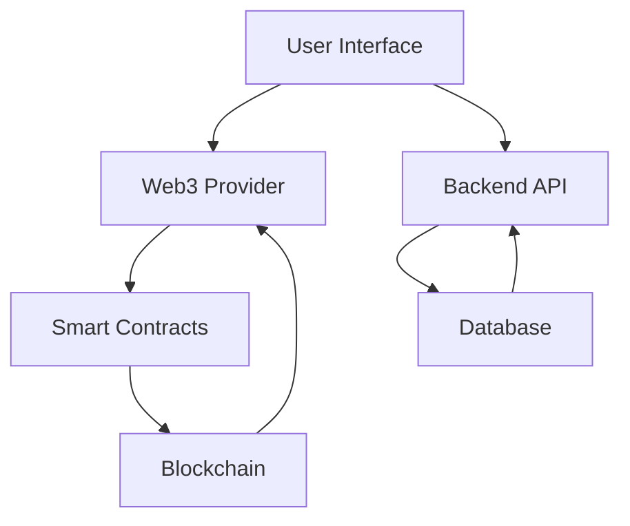

# The Astronauts DAO - Architecture Overview

## System Architecture

The Astronauts DAO is built using a modern, scalable architecture that combines blockchain technology with traditional web development practices.

### Frontend Architecture

- **Framework**: Next.js 14 with React 18
- **Styling**: Tailwind CSS with Radix UI components
- **State Management**: React Query and Zustand
- **Web3 Integration**: wagmi and viem
- **Type Safety**: TypeScript

### Backend Architecture

- **Framework**: Express.js with TypeScript
- **Database**: PostgreSQL with Prisma ORM
- **API Design**: RESTful with OpenAPI specification
- **Authentication**: JWT with Web3 wallet signatures
- **Logging**: Winston

### Smart Contracts

- **Network**: Ethereum/Polygon/Solana
- **Language**: Solidity
- **Testing**: Hardhat and Foundry
- **Deployment**: Hardhat with multi-sig support

## Key Components

### Proposal System

1. **Creation**
   - Form validation
   - Preview functionality
   - Action builder
   - Template system

2. **Voting**
   - Token-weighted voting
   - Delegation support
   - Vote tracking
   - Real-time updates

3. **Execution**
   - Multi-signature support
   - Timelock integration
   - Transaction batching
   - Failure recovery

### Treasury Management

1. **Asset Tracking**
   - Multi-token support
   - Price feeds
   - Historical data
   - Analytics dashboard

2. **Transaction Management**
   - Multi-signature requirements
   - Spending limits
   - Transaction categories
   - Audit trail

### Member Management

1. **Access Control**
   - Role-based permissions
   - Token gating
   - Activity tracking
   - Reputation system

2. **Communication**
   - Proposal discussions
   - Member directory
   - Notification system
   - Activity feed

## Data Flow

## Security Considerations

1. **Smart Contract Security**
   - Formal verification
   - Audit requirements
   - Upgrade mechanisms
   - Emergency procedures

2. **API Security**
   - Rate limiting
   - Input validation
   - Authentication
   - Authorization

3. **Data Security**
   - Encryption at rest
   - Secure communication
   - Access logging
   - Backup procedures

## Scalability

1. **Frontend**
   - Static generation
   - Incremental builds
   - Edge caching
   - Code splitting

2. **Backend**
   - Horizontal scaling
   - Caching layers
   - Database optimization
   - Load balancing

3. **Blockchain**
   - Layer 2 support
   - Cross-chain bridges
   - State channels
   - Optimistic rollups

## Development Workflow

1. **Local Development**
   - Hot reloading
   - Test networks
   - Mock data
   - Development tools

2. **Testing**
   - Unit tests
   - Integration tests
   - End-to-end tests
   - Contract tests

3. **Deployment**
   - CI/CD pipeline
   - Environment management
   - Monitoring
   - Rollback procedures

## Future Considerations

1. **Cross-chain Support**
   - Multiple networks
   - Bridge integration
   - Asset management
   - Unified interface

2. **Governance Evolution**
   - Quadratic voting
   - Conviction voting
   - Optimistic governance
   - Rage quit mechanisms

3. **Integration Possibilities**
   - DeFi protocols
   - NFT platforms
   - Identity solutions
   - Oracle services 